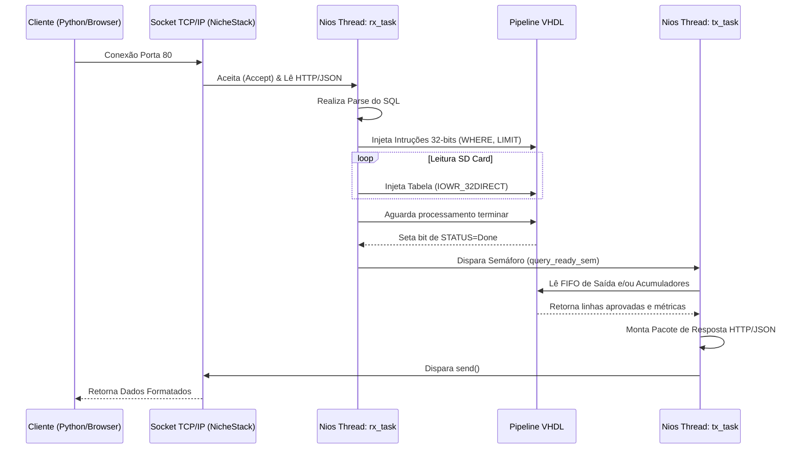

# Relatório Final: Banco de Dados Acelerado em FPGA

## 1. Descrição do Objetivo do Projeto
O objetivo primário deste projeto é implementar um **Mecanismo de Banco de Dados Acelerado por Hardware (Hardware-Accelerated Database Engine)** na placa Altera DE-2/Cyclone 10. O sistema é capaz de receber e executar consultas SQL (com suporte a filtros `WHERE`, paginação `LIMIT`, e agregadores como `COUNT` e `SUM`) extraindo dados físicos do SD Card. 

Em vez de sobrecarregar o processador embarcado avaliando lógicas condicionais byte a byte para cada registro, o projeto offloads (terceiriza) a carga pesada de filtragem para um acelerador construído nativamente em **VHDL**. 

### Interação com Outros Projetos (Ecossistema)
O sistema atua como um servidor back-end operando via rede, o que lhe permite interagir ativamente com plataformas de terceiros no modelo Cliente-Servidor. O projeto foi projetado para interoperar com:
1. **Dashboard Web (HTML/JS):** Uma aplicação Web UI que envia consultas dinamicamente e formata respostas.
2. **Scripts Python:** Validador e stress-tester (`fpga_test.py`) que confronta os limites e velocidade da placa através de um socket TCP padronizado.

---

## 2. Descrição dos Módulos

### 2.1 Módulos em VHDL (Camada de Hardware)
- **`user_hw.v`**: É o *wrapper* (empacotador) em Verilog responsável por atuar como ponte entre o processador Nios II e nossa lógica proprietária, ligando os sinais do barramento padrão da Altera (Avalon-MM) aos pinos customizados.
- **`pipeline.vhd`**: O motor principal (Core) da aplicação. Opera como uma esteira contínua que recebe os bytes do arquivo de banco de dados por um lado e instruções lógicas (AND, OR, ==) por outro, utilizando FIFO (First-In, First-Out) para enfileirar as respostas filtradas.
- **`count.vhd` e `sum.vhd`**: Co-processadores agregadores ligados em paralelo na pipeline. Eles não dependem da ULA do processador Nios; eles recebem dados brutos das colunas, convertem do padrão ASCII para numérico (binário), somam e armazenam contagens ou totais, fornecendo um resultado absoluto sob requisição.

### 2.2 Módulos em C (Firmware e RTOS)
- **`network_tasks.c`**: Contém todo o firmware aplicativo escrito em C rodando embarcado. Suas responsabilidades são:
  - Fazer o *parsing* do protocolo HTTP e do SQL recebido.
  - Ler arquivos do Banco de Dados (.tbl) hospedados em um *SD_CARD* usando File I/O HAL da Altera.
  - Enviar instruções binárias e blocos de tabela para os registradores VHDL.
- **Interação com o Sistema Operacional**: O firmware é orquestrado pelo SO em tempo real **MicroC/OS-II (`uC/OS-II`)**. Ele levanta processos e gerencia o RTOS alocando Semáforos e escalonando tarefas para não travar a recepção de dados, abstraindo também o File System e a Stack TCP/IP (NicheStack).

---

## 3. Detalhes de Implementação
A integração ocorre de forma híbrida: **Soft-Core CPU (Nios II) + Custom IP (VHDL)**.
1. O Nios II aloca espaço de RAM (Static Buffers) para capturar grandes pacotes. Inicialmente sofremos gargalos lendo as linhas (teto estático de 16 blocos), mas a arquitetura foi expandida para limites elásticos suportando tabelas inteiras.
2. O mapeamento da memória (Memory-Mapped Registers) foi desenhado em barramentos de 32-bits alocados sob endereços fixos, como:
   - `0x00` (Control) e `0x04` (Data IN)
   - `0x08` (Instruction IN)
   - `0x10` (Data OUT) e `0x14` (Accumulator OUT)
3. A comunicação usa portas padrão, sem proxies, lendo byte a byte do arquivo e enviando-o via macro `IOWR_32DIRECT`.

---

## 4. Esquemáticos da Arquitetura

### 4.1 Esquemático Global do Sistema (Hardware + Rede + Cliente)
```mermaid
flowchart TD
    subgraph PC_CLIENT [PC / Cliente TCP/IP]
        Web(Dashboard Web - index.html)
        Py(fpga_test.py)
    end
    
    subgraph DE2_BOARD [Placa FPGA Altera DE-2]
        subgraph NIOS [Processador Nios II (RTOS MicroC)]
            Net(NicheStack TCP/IP Stack)
            RxTx[network_tasks.c \n Threads rx_task / tx_task]
        end
        
        subgraph HAL_DEVICES [Controladoras Nativas]
            ETH[Controladora Ethernet MAC]
            SD[Controladora SD Card]
        end
        
        subgraph CUSTOM_IP [Acelerador VHDL Customizado]
            AVALON{Barramento Avalon-MM}
            WRAPPER(user_hw.v)
            PIPE(pipeline.vhd)
            COUNT(count.vhd)
            SUM(sum.vhd)
        end
    end

    %% Conexões Rede
    Web <-->|TCP / HTTP :80| ETH
    Py <-->|TCP Sockets :80| ETH
    ETH <-->|Pacotes| Net
    Net <--> RxTx
    
    %% Conexões Fisicas/Memoria
    RxTx -->|Ler tabela| SD
    RxTx <-->|IOWR / IORD | AVALON
    AVALON <--> WRAPPER
    
    %% VHDL Interno
    WRAPPER <-->|Registradores| PIPE
    PIPE --> COUNT
    PIPE --> SUM
```

### 4.2 Esquemático do Fluxo de Rede (Threads do Sistema Operacional)


### 4.3 Esquemático Interno do Módulo VHDL
```mermaid
flowchart LR
    subgraph user_hw [Wrapper Avalon (user_hw.v)]
        din[0x04: DATA_IN]
        inst[0x08: INSTRUCTION]
        ctrl[0x00: CONTROL]
        dout[0x10: DATA_OUT]
        acc[0x14: ACCUMULATOR]
    end

    subgraph pipeline [Core VHDL (pipeline.vhd)]
        decoder[Decodificador de Instruções]
        comparator[Comparadores Lógicos <, >, =]
        fifo[(FIFO - Fila de Resultados)]
        subgraph aggs [Co-Processadores]
            c[count.vhd]
            s[sum.vhd]
        end
    end
    
    %% Fluxo de Entrada
    inst --> decoder
    din --> comparator
    din --> aggs
    
    %% Processamento
    decoder --> comparator
    comparator -- Linha Válida --> fifo
    comparator -- Linha Válida --> c
    comparator -- Linha Válida --> s
    
    %% Fluxo de Saída
    fifo --> dout
    aggs --> acc
```
