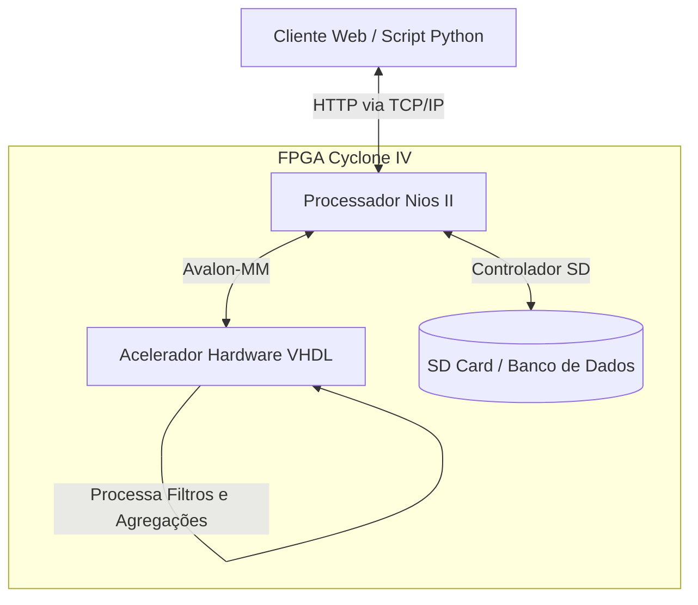
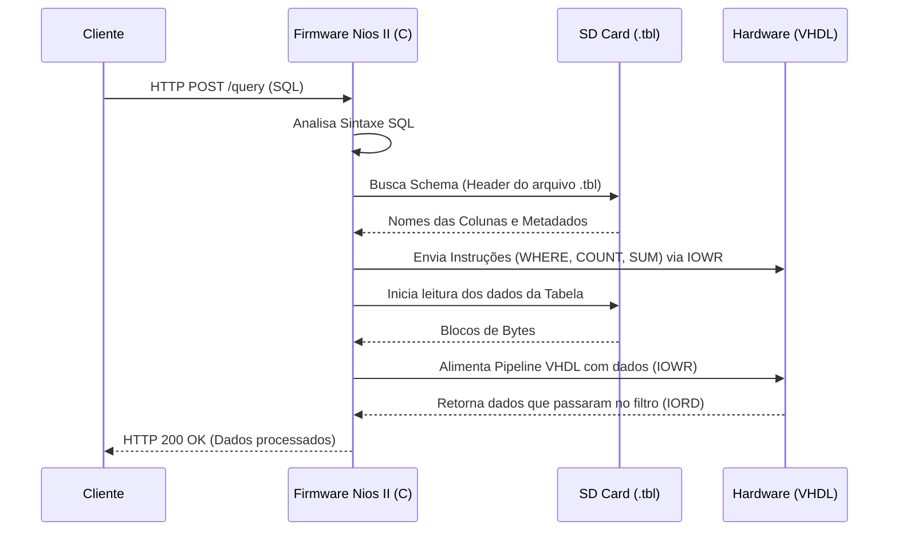
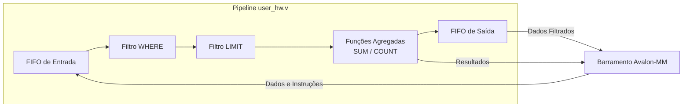
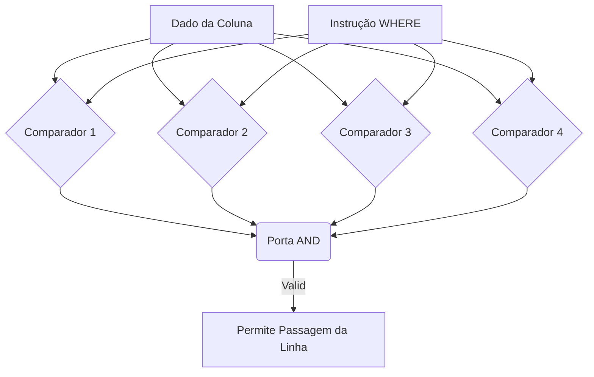

# Relatório Final do Projeto

## Objetivo do Projeto

O projeto implementa um servidor de consultas sobre a placa Altera DE-2 usando Nios II, NicheStack e um bloco customizado em HDL. O sistema recebe requisições HTTP pela rede, extrai do corpo da mensagem os campos TABLE, LIMIT e SQL, carrega a tabela correspondente do SD card e converte a consulta em instruções de 32 bits enviadas ao IP user_hw por meio de registradores Avalon-MM.

Na prática, o firmware embarcado aceita consultas do tipo SELECT com WHERE, LIMIT, COUNT e SUM. O resultado é devolvido como texto simples em HTTP. Pelos arquivos de apoio, o projeto também pode ser integrado a clientes em navegador e a scripts Python de teste. O mock local em tcpserver.py e o gerador de tabelas em table_format.py mostram que o protocolo esperado é o mesmo tanto para a placa quanto para a simulação de PC.

### Interação com Outros Sistemas

O fluxo de uso do projeto é compatível com um modelo cliente-servidor. O cliente pode ser um navegador, um script Python ou outra aplicação que envie POST para /query. O backend embarcado processa a consulta e responde com os registros filtrados ou com agregações numéricas. O código não implementa integração com banco de dados remoto; a origem dos dados é o SD card local da placa.

## Descrição dos Módulos

### VHDL / Verilog

O módulo de integração é [ProjetoFinal/DE2_NET/ip/user_hw/user_hw.v](ProjetoFinal/DE2_NET/ip/user_hw/user_hw.v). Ele expõe um slave Avalon-MM com endereço de 7 bits, dados e readdata de 32 bits e sinal de byteenable. O mapa funcional usado pelo firmware é:

- 0x00: CONTROL, escrita com pulsos de controle.
- 0x04: DATA_IN, escrita do dado da tabela.
- 0x08: INSTRUCTION, escrita das instruções de WHERE, LIMIT, COUNT e SUM.
- 0x0C: STATUS, leitura de flags do pipeline.
- 0x10: DATA_OUT, leitura da FIFO de saída.
- 0x14: ACCUMULATOR, leitura do COUNT.
- 0x18: SUM, leitura do acumulador de soma.

O bloco principal está em [vhdl/pipeline.vhd](vhdl/pipeline.vhd). Ele instancia:

- [vhdl/FIFO.vhd](vhdl/FIFO.vhd), para a FIFO de entrada e a FIFO de saída.
- [vhdl/whereFilter.vhd](vhdl/whereFilter.vhd), para os comparadores do WHERE.
- [vhdl/limit.vhd](vhdl/limit.vhd), para bloquear a saída após atingir o limite.
- [vhdl/count.vhd](vhdl/count.vhd), para COUNT em 32 bits.
- [vhdl/sum.vhd](vhdl/sum.vhd), para SUM em 32 bits.

O pipeline aceita até quatro condições WHERE encadeadas por AND, porque o próprio código limita o contador de WHERE a NUM_WHERE = 4. O módulo limit também funciona de forma transparente quando o LIMIT não está ativo. O bloco count incrementa a cada linha válida e o bloco sum acumula o valor ASCII convertido subtraindo 48, portanto ele foi projetado para somar dígitos de 0 a 9 e não campos arbitrários de texto.

O top-level da placa em [ProjetoFinal/DE2_NET/DE2_NET.v](ProjetoFinal/DE2_NET/DE2_NET.v) expõe Ethernet, SD card, LCD, VGA, SRAM, USB e os demais periféricos padrão da Terasic, mas o fluxo funcional do projeto usa de fato Ethernet via DM9000A e SD card como origem dos dados.

### C / Software

O ponto de entrada do firmware está em [ProjetoFinal/DE2_NET/software/nios/main.c](ProjetoFinal/DE2_NET/software/nios/main.c). Ele inicializa a controladora DM9000A, tenta iniciar o SD card, sobe o NicheStack com alt_iniche_init() e netmain(), espera o sinal iniche_net_ready e então cria as tasks de rede.

A camada de aplicação está em [ProjetoFinal/DE2_NET/software/nios/network_tasks.c](ProjetoFinal/DE2_NET/software/nios/network_tasks.c). O arquivo cria duas tasks com uC/OS-II:

- rx_task, que abre socket TCP na porta 80, faz bind, listen, accept e recv.
- tx_task, que espera um semáforo query_ready_sem e monta a resposta.

O protocolo esperado não é JSON. O firmware procura um corpo de texto simples com linhas TABLE=, LIMIT= e SQL=. A parser extrai o nome da tabela, o limite e o SQL, valida identificadores e separa SELECT, FROM, WHERE e LIMIT. Em seguida, a rotina compile_and_send_instructions converte a consulta em palavras de 32 bits e grava o IP customizado com IOWR_32DIRECT.

O driver do cartão SD está em [ProjetoFinal/DE2_NET/software/nios/sd_driver.c](ProjetoFinal/DE2_NET/software/nios/sd_driver.c). Ele faz SPI por bit-bang usando SD_CLK, SD_CMD e SD_DAT. O chip select é controlado pelo LED_RED[17], e os comentários do próprio código deixam isso explícito. O firmware lê os bytes da tabela do SD, valida o cabeçalho TBL8 e alimenta o pipeline em blocos de 4 bytes.

O arquivo [ProjetoFinal/DE2_NET/software/nios/dm9000a.c](ProjetoFinal/DE2_NET/software/nios/dm9000a.c) mostra a integração com a interface Ethernet da placa, enquanto [ProjetoFinal/DE2_NET/software/nios/mac_ip_utils.c](ProjetoFinal/DE2_NET/software/nios/mac_ip_utils.c) fixa MAC e IP de fallback e marca o uso de DHCP. Isso confirma que a rede externa é fornecida pelo DM9000A e não por pthreads ou sockets do sistema operacional do PC.

### Sistema Operacional

O código embarcado roda sobre uC/OS-II. Não há pthreads POSIX no firmware da placa. As tasks são criadas com OSTaskCreateExt, sincronizadas com OSSemCreate, OSSemPost e OSSemPend, e o escalonamento fica a cargo do RTOS.

A pilha TCP/IP usada é o NicheStack, como se vê em [ProjetoFinal/DE2_NET/software/nios/main.c](ProjetoFinal/DE2_NET/software/nios/main.c) e nos includes de [ProjetoFinal/DE2_NET/software/nios/network_tasks.c](ProjetoFinal/DE2_NET/software/nios/network_tasks.c). O firmware apenas coordena a entrada e a saída de dados enquanto o RTOS e a stack cuidam da comunicação de rede.

## Detalhes de Implementação

O fluxo de dados do projeto é o seguinte:

1. Um cliente HTTP envia POST para /query com TABLE, LIMIT e SQL.
2. rx_task recebe a mensagem pelo socket TCP, valida os campos e grava a estrutura pending_request.
3. tx_task acorda via semáforo e chama process_request.
4. O firmware carrega a tabela .tbl8 do SD card para memória buffer, lendo primeiro o cabeçalho e depois o payload.
5. O SQL é traduzido em instruções 32 bits e enviado ao IP user_hw.
6. Os dados da tabela são empurrados para DATA_IN, um word de 32 bits por vez, com pulso em CONTROL.
7. Quando o final da entrada é atingido, o firmware sinaliza EOF ao hardware.
8. O hardware processa WHERE, LIMIT e os agregadores COUNT/SUM, escrevendo as linhas aprovadas na FIFO de saída e os resultados numéricos em ACCUMULATOR e SUM.
9. O firmware faz drain da FIFO de saída e monta a resposta HTTP em texto.

A arquitetura é fortemente memory-mapped. O software não chama funções mágicas do hardware; ele grava e lê endereços fixos. Isso fica claro nos macros HW_REG_CONTROL_OFFSET, HW_REG_DATA_IN_OFFSET, HW_REG_INSTRUCTION_OFFSET, HW_REG_STATUS_OFFSET, HW_REG_DATA_OUT_OFFSET, HW_REG_ACCUMULATOR_OFFSET e HW_REG_SUM_OFFSET em [ProjetoFinal/DE2_NET/software/nios/network_tasks.c](ProjetoFinal/DE2_NET/software/nios/network_tasks.c).

O formato de tabela também é importante para a arquitetura. [ProjetoFinal/table_format.py](ProjetoFinal/table_format.py) mostra que os arquivos .tbl8 usam:

- magic TBL8
- versao 1
- até 4 colunas
- 1 byte por célula
- cabeçalho fixo de 24 + 4 bytes de nomes
- row_width igual a 4 bytes por linha

Isso explica por que o bloco sum trabalha com dígitos ASCII de 1 byte e por que o firmware trata os dados como blocos de 4 bytes.

## Diagramas da Arquitetura

### Visão Geral do Sistema

Este diagrama mostra o fluxo geral entre os principais atores do projeto: cliente, Nios II, SD card e acelerador em FPGA.

### Diagrama de Comunicação

Este fluxo detalha a comunicação do firmware em C: o cliente envia a requisição, o Nios II interpreta o SQL, consulta o SD card e injeta instruções e dados no hardware.

### Arquitetura do Pipeline VHDL

Este esquema representa os blocos lógicos construídos na FPGA para acelerar a filtragem e a agregação sobre a tabela lida do SD card.

### Bloco where_filter

Este diagrama resume a lógica do filtro WHERE: cada comparação recebe a instrução correspondente, e o resultado final depende da combinação encadeada das comparações ativas.

## Variantes Históricas

O projeto contém ainda variantes históricas em [old_network.c](old_network.c) e [older_network.c](older_network.c), que preservam a mesma ideia geral de consulta e comunicação com hardware, mas o fluxo atualmente consistente é o da árvore [ProjetoFinal/DE2_NET/software/nios](ProjetoFinal/DE2_NET/software/nios).

## Considerações Técnicas

Para validação fora da FPGA, [ProjetoFinal/tcpserver.py](ProjetoFinal/tcpserver.py) implementa um servidor mock em Python que responde o mesmo formato textual e [ProjetoFinal/fpga_test.py](ProjetoFinal/fpga_test.py) monta requisições HTTP para testar a placa. Esses arquivos não fazem parte do bitstream, mas ajudam a reproduzir e verificar o comportamento end-to-end.
