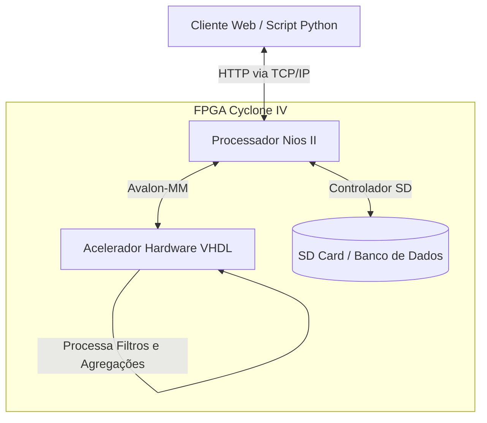
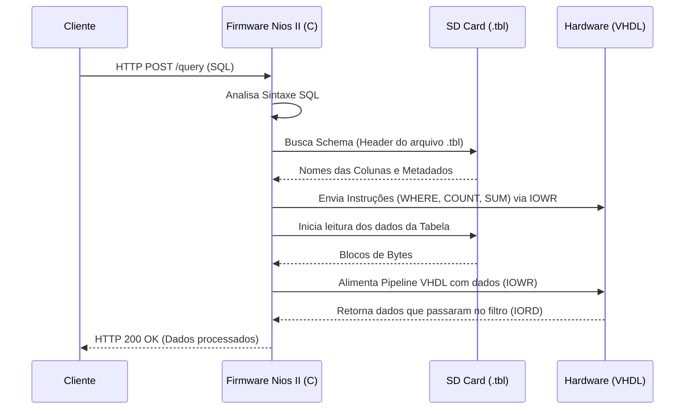
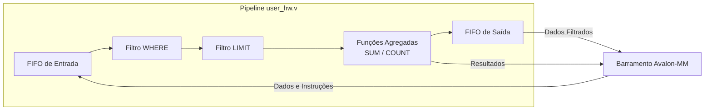
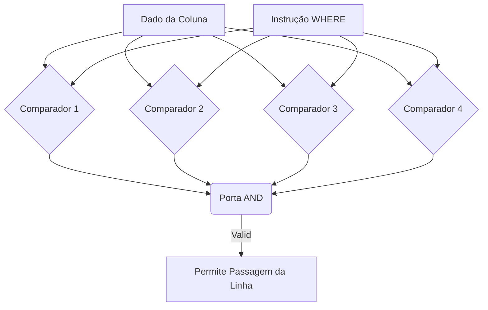

# Diagramas do Projeto

Estes diagramas ilustram a arquitetura geral e as partes específicas do nosso sistema de Banco de Dados na FPGA. Como a nossa interface aqui suporta o formato **Mermaid**, os diagramas já devem estar renderizados visualmente para você. 

Para colocar no seu Google Docs, você pode simplesmente tirar um *print screen* (captura de tela) da imagem gerada aqui, ou copiar os blocos de texto e jogar no site [Mermaid Live Editor](https://mermaid.live/) para baixar em PNG/SVG de alta qualidade.

## 1. Visão Geral do Sistema (System Overview)

Este diagrama mostra o fluxo geral entre os principais atores do nosso projeto:

## 2. Diagrama de Comunicação (Rede e Software)

Como ocorre a comunicação e tradução das Queries no firmware em C.

## 3. Arquitetura do Pipeline VHDL (Hardware)

Este esquema representa os blocos lógicos construídos na FPGA para acelerar a busca no banco de dados.

## 4. Detalhes do Bloco `where_filter`

Detalhes de como o pipeline compara as informações de maneira encadeada.

